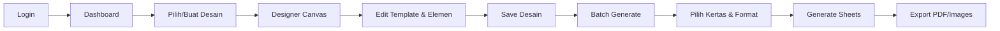

# 🎨 DoneTix Wristband Designer

> Aplikasi desktop untuk mendesain dan mencetak wristband event secara massal


---

## 📋 Deskripsi

**DoneTix Wristband Designer** adalah aplikasi desktop yang dikembangkan khusus untuk staff DoneTix untuk mendesain template wristband dan mencetak ribuan wristband unik dengan QR code, nomor kursi, dan kode tiket secara otomatis.

---

## ✨ Fitur Utama

### 🎯 Designer Canvas
- **Drag & Drop Editor** - Edit posisi elemen dengan mudah menggunakan mouse
- **Multi-Element Support**:
  - 📸 Template background (upload gambar custom)
  - 🔤 Custom Text dengan berbagai font
  - 📊 QR Code otomatis dari kode wristband
  - 🎫 Kode Tiket (code dari API)
  - 💺 Nomor Kursi (format: Prefix + Number + Suffix)
  - 📝 Judul Slot/Event
- **Property Panel** - Edit font, ukuran, warna, rotasi, opacity
- **8+ Font Premium** termasuk Poppins, Montserrat, Bebas Neue, Inter, dll
- **Auto-save** ke local storage

### 🖨️ Batch Generate & Print
- **Smart Layout Algorithm** - Otomatis hitung layout optimal untuk kertas
- **Multi Paper Size**: A4, A3, F4, Letter, Legal
- **Edge-to-Edge Packing** - 0mm gap untuk efisiensi maksimal
- **Export Format**: PDF, PNG, JPG
- **Streaming Memory Management** - Generate 1000+ sheet tanpa crash
- **Export Progress** - Tampilan persentase saat export

### 🔄 Auto-Update
- **GitHub Releases Integration** - Update otomatis dari cloud
- **Silent Download** - Download update di background
- **Restart Prompt** - Dialog untuk install update

### 🔐 Security
- **Code Obfuscation** - Source code terproteksi
- **DevTools Disabled** - Tidak bisa inspect di production
- **API Token Auth** - Autentikasi dengan backend DoneTix

---

## 🛠️ Tech Stack

| Teknologi | Kegunaan |
|-----------|----------|
| **Electron 39** | Framework desktop app cross-platform |
| **React 19** | UI library dengan concurrent rendering |
| **TypeScript 5.9** | Type-safe JavaScript |
| **Vite 7** | Build tool super cepat dengan HMR |
| **Fabric.js 6** | Canvas library untuk editor visual |
| **TailwindCSS 4** | Utility-first CSS framework |
| **Zustand 5** | State management ringan |
| **jsPDF** | Generate PDF multi-page |
| **JSZip** | Bundling export ke ZIP |
| **QRCode** | Generate QR code dinamis |
| **electron-updater** | Auto-update dari GitHub |

---

## 🚀 Quick Start

### Development
```bash
# Install dependencies
npm install

# Run development mode
npm run dev
```

### Production Build
```bash
# Build tanpa publish
npm run build

# Build dan publish ke GitHub releases
npm run build-release
```

---

## 📁 Struktur Project

```
Designapp/
├── electron/           # Electron main process
│   ├── main.ts        # Entry point, IPC handlers
│   ├── preload.ts     # Context bridge
│   └── logger.ts      # Logging utility
├── src/
│   ├── pages/
│   │   ├── Login.tsx      # Halaman login
│   │   ├── Dashboard.tsx  # Daftar desain
│   │   ├── Designer.tsx   # Editor canvas
│   │   └── BatchGenerate.tsx  # Batch print
│   ├── stores/            # Zustand stores
│   ├── utils/             # Helper functions
│   │   ├── sheetGenerator.ts  # Generate print sheets
│   │   ├── qrGenerator.ts     # QR code generator
│   │   ├── fontLoader.ts      # Font management
│   │   └── textFactory.ts     # Text element factory
│   └── types/             # TypeScript definitions
├── asset/                 # Icons & images
└── scripts/               # Build scripts
```

---

## 📦 Scripts

| Script | Deskripsi |
|--------|-----------|
| `npm run dev` | Development mode dengan hot reload |
| `npm run dev:web` | Web-only development (tanpa Electron) |
| `npm run build` | Build production (tanpa publish) |
| `npm run build-release` | Build dan upload ke GitHub releases |
| `npm run lint` | Check code quality |

---

## ⚙️ Environment Variables

File `.env` di root project:

```env
# API Backend DoneTix
VITE_API_URL=https://tiket.digitaldepot.id/api

# App Name
VITE_APP_NAME=DoneTix

# GitHub Token untuk auto-update (saat build-release)
GH_TOKEN=your_github_personal_access_token
```

---

## 🎨 Flow Penggunaan



1. **Login** dengan akun staff DoneTix
2. **Dashboard** - Lihat desain yang sudah dibuat atau buat baru
3. **Designer** - Upload template, tambah elemen (QR, teks, nomor kursi)
4. **Batch Generate** - Pilih ukuran kertas, generate semua wristband
5. **Export** - Download sebagai PDF atau ZIP images

---

## 📝 Catatan Penting

> [!IMPORTANT]
> Untuk menjalankan `build-release`, pastikan `GH_TOKEN` sudah diset dengan GitHub Personal Access Token yang memiliki scope `repo`.

> [!TIP]
> Gunakan format PDF untuk print langsung ke printer. Gunakan format PNG/JPG jika perlu edit lanjutan di software lain.

> [!NOTE]
> Aplikasi otomatis check update setiap kali dibuka. Jika ada versi baru, akan muncul dialog untuk restart dan install.

---

## 👥 Tim Development

Dikembangkan oleh **DoneTix Engineering Team**

---

*© 2024 DoneTix. Internal use only.*
